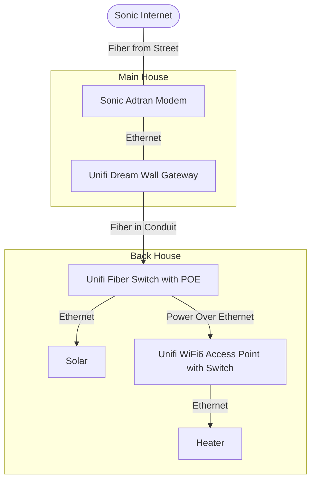

```mermaid
graph TB;
    classDef optional stroke-dasharray: 5 5;
    ISP([Sonic Internet]) -- Fiber from Street --- ONT[Sonic Adtran Modem];
    subgraph Main House
        ONT -- Ethernet --- UDW[Unifi Dream Wall Gateway];
    end
    subgraph Back House
        UDW -- Fiber in Conduit --> USWE8[Unifi Fiber Switch with POE];
        USWE8 -- Ethernet --> Solar;
        USWE8 -- Power Over Ethernet --> U6EIW[Unifi WiFi6 Access Point with Switch];
        U6EIW -- Ethernet --> Heater;
    end
```
