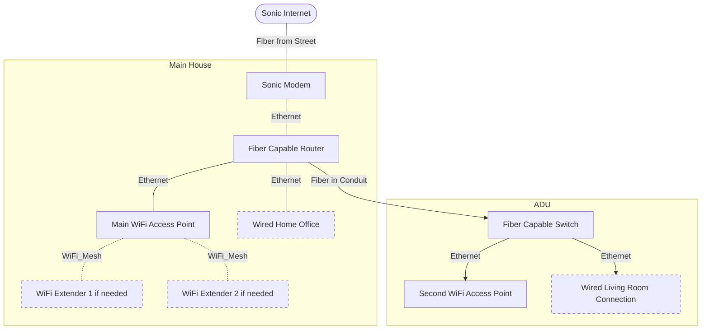

```mermaid
graph TB;
    classDef optional stroke-dasharray: 5 5;
    ISP([Sonic Internet]) -- Fiber from Street --- Adtran-411-ONT[Sonic Modem];
    subgraph Main House
        Adtran-411-ONT -- Ethernet --- UDM-SE[Fiber Capable Router];
        UDM-SE -- Ethernet --- U6Lite1[Main WiFi Access Point];
        UDM-SE -- Ethernet --- HomeOffice[Wired Home Office]:::optional;
        U6Lite1 -. WiFi_Mesh .- U6Ext1[WiFi Extender 1 if needed]:::optional;
        U6Lite1 -. WiFi_Mesh .- U6Ext2[WiFi Extender 2 if needed]:::optional;
    end
    subgraph ADU
        UDM-SE -- Fiber in Conduit --> USW-Switch[Fiber Capable Switch];
        USW-Switch -- Ethernet --> U6Lite2[Second WiFi Access Point];
        USW-Switch -- Ethernet --> LivingRoom[Wired Living Room Connection]:::optional;
    end
```
