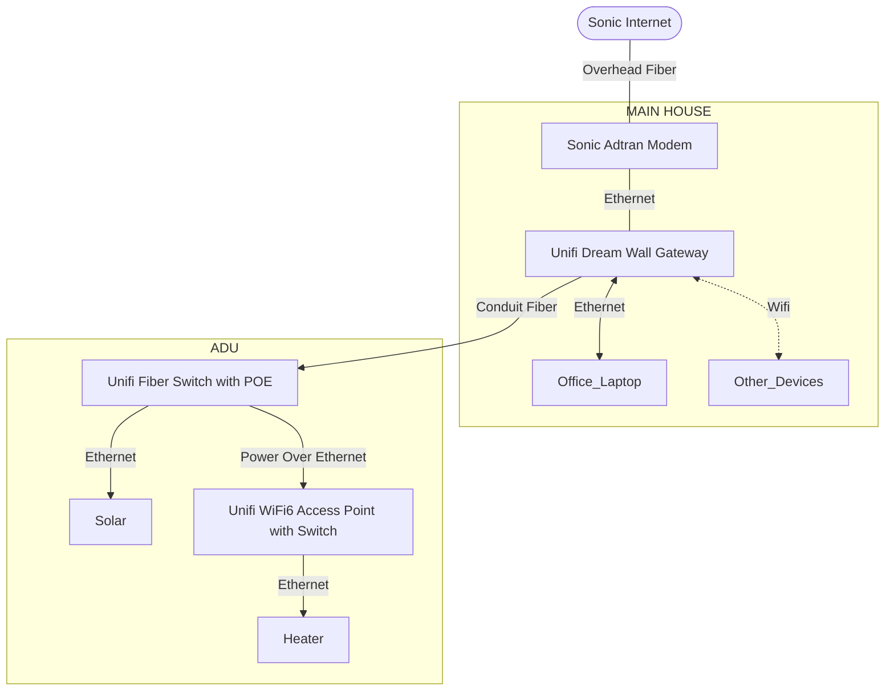

```mermaid
graph TD;
    classDef optional stroke-dasharray: 5 5
    ISP([Sonic Internet]) -- Overhead Fiber --- ONT[Sonic Adtran Modem]
    subgraph MAIN HOUSE
        ONT -- Ethernet --- UDW[Unifi Dream Wall Gateway]
        UDW <-- Ethernet --> Office_Laptop
        UDW <-. Wifi .-> Other_Devices
    end
    subgraph ADU
        UDW -- Conduit Fiber --> USW-E8-POE[Unifi Fiber Switch with POE]
        USW-E8-POE -- Ethernet --> Solar
        USW-E8-POE -- Power Over Ethernet --> U6-IW[Unifi WiFi6 Access Point with Switch]
        U6-IW -- Ethernet --> Heater
    end
```
